https://github.com/user-attachments/assets/e22668da-0f95-4c17-be00-5943a10a3cfc

# javarominoes

*A Tetris-inspired block stacking puzzle game, implemented using Java's Swing libraries. Dedicated to my dear Granddad.*

## Overview

Javarominoes is a Java-based tetris-inspired game that I wrote for fun. I have faithfully replicated all major features from prior installments of the series, **excluding only**:

- T-spin point awards
- Type-B mode
- Locally cached high scores

For a list of all implemented features, see the section below. The game was built entirely in Java, relying only on core JRE features and my own [ChiptuneSynth](https://github.com/dylantcon/chiptune-synth) library, and packaged into a single runnable fat JAR. As such, if you have the JRE installed (https://www.oracle.com/java/technologies/javase/jdk22-archive-downloads.html), you should be able to simply double-click the `Javarominoes.jar` file and it will fire up.

## Features

**Fair Piece Generation**: I've implemented the so-called "bag" method for random piece generation, ensuring a balanced distribution of all tetrominoes throughout gameplay. An array holds all 7 of the pieces, which I shuffle using the **Fisher-Yates algorithm**. The program will iterate through the list after every new piece is generated, and after we reach the end, the array is repopulated and reshuffled. Thus, the longest possible 'drought' between identical pieces is *13*. This fixes an issue present in the original Tetris title for the NES, which uses a [linear feedback shift register](https://arxiv.org/html/2404.12011v1) to generate random pieces without a piece buffer array. The naive LFSR approach might cause a scenario in which the user does not receive an 'I' piece for 20 or more piece generations, effectively ending their game and causing understandable frustration.

**Difficulty Scaling**: I used a mix of logarithmic and linear functions to determine how the time-to-descend (TTD) changes based on the player's score. Initially, to facilitate an engaging early-game, the time-to-descend in milliseconds is determined by the average of a logarithmic and linear function of score. Once the linear function intersects with the logarithmic function at around 13,000 score, it relies solely on the logarithmic function for the remainder of the game. This keeps things paced properly and gives the user a sense of urgency.

**Graphical Interface**: I built the graphical interface using Java Swing, with `java.awt.Graphics` primarily. I do use `java.awt.Graphics2D` for the nice top-to-bottom gradient coloring on the horizontal board area padding. The game should flexibly rescale to almost any window size, with some necessary exceptions made (for disproportionately tall or wide windows) to maintain the proper dimensions for the game board.

**Pause and Unpause**: Not finished with your game, and need to take care of something else? No worries, just hit `Esc` to pause, and either `Esc` again to unpause, or click the Resume menu button. There's also an option to restart your current game if desired. Finally, if you decide that you're actually all finished playing, you can also use the menu buttons to quit to the main menu. Something to note, my pausing system accounts for elapsed time since last tick, so **no, you cannot repeatedly pause and unpause to suspend a piece for a longer duration**.

**Main Menu with Parallax Effect**: For polish, I added a main menu. You can play a game of Javarominoes from here by clicking the respective button, or exit to desktop if all finished. Behind the title, subtitle, and buttons, a vibrant and dynamic landscape of blocks can be seen. I used my knowledge of the geometric series to create a hierarchy of layers, with each layer having a smaller block size than the one in front of it. Let's suppose that we specify a base block size in inches, and multiply by the PPI of the monitor to obtain a value in pixels. If the base block size at the foreground is $B_b$, the panel has $n$ backing layers, and specifies a common ratio of $r$, then all we need to do to visualize the parallax effect is specify a scroll speed $S$ in units of $\frac{\text{blocks}}{\text{s}}$. Then, the layers have block sizes $S_l = \{r^0 \times B_b, r^1 \times B_b, \cdots , r^{n-1} \times B_b, r^n \times B_b\}$, causing layers in the back to support a proportionately higher block-per-inch density. Since all layers scroll at the same rate in blocks per second, layers with higher block densities will appear to move slower than those with lower block densities. This approach models the problem so well that adjusting a field such as layer count, scroll speed, base block size, or panel refresh rate can be done by changing just one static constant. I did have to implement sub-pixel accumulators in the form of a parallel array of floats, as initially layers with very small calculated block sizes would move such a small distance every tick that the calculated coordinates for re-render would truncate to their original value pre-tick.

**Score Tracking and Game Mechanics**: As I already mentioned, there's dynamic time-to-descend based on score, and unlike the original NES Tetris, speed increases are not arbitrarily discretized by "Level". Speed of piece descent is directly mapped to the player's current score. I also made sure to reward players for higher simultaneous line clears, in a manner consistent with the approach found in mainline Tetris titles. Since my game speed calculation system is slightly different, I adjusted the point awards to compensate. The rewards are still proportionally consistent with the original design, though their exact numeric values may differ. Also, the game has piece previews, which I know was something that a few Tetris titles omitted.

**In-Game Music**: I used Java's data line `SourceDataLine` in an attempt to mimic the sound of the [Ricoh 2A03 Audio Processing Unit](https://en.wikipedia.org/wiki/Ricoh_2A03), the chiptune synthesizer responsible for the upbeat, cheery electronic sound that is associated with the Nintendo Entertainment System. The player has the option to select one of any ten tracks to play during the game, at their leisure. All songs automatically increase their tempo in response to reaching certain score thresholds, up to the maximum acceleration factor of 2.0x. For an in-depth writeup on the `ChiptuneSynth` that evolved into a separate repository and project, please see the [synthesizer README](https://raw.githubusercontent.com/dylantcon/chiptune-synth/master/README.md). I selected a couple of interesting tracks from NES video game titles, and wrote covers for each using the synthesizer API that I created. So, to be absolutely, indisputably clear: I do not own any of the compositions that the synthesizer plays, nor am I attempting to take credit for them in any capacity. These are covers of the original soundtracks, written by a fan (me) for other people's listening pleasure. All credit goes to the creators, owners, and/or publishers for each work in question, specifically Yakov Prigozhy (*Korobeiniki*, Independent Russian Publisher, 1898), Takashi Tateishi (*Flash Man Theme, Dr. Wily: Stage 1 Theme*, Mega Man 2, 1988), Kenichi Matsubara and Satoe Terashima (*Bloody Tears*, Castlevania 2, 1987), Hidenori Maezawa and Kiyohiro Sada (*Jungle*, Contra, 1988), David Wise (*Surf City and Terra Tubes*, Battletoads, 1991), Akito Nakatsuka (*Palace*, a.k.a. *Hyrule Temple*, The Legend of Zelda II: The Adventure of Link), Hiroshige Tonomura (*The Moon*, DuckTales, 1989), Koji Kondo (*Dungeon*, The Legend of Zelda, 1986), Geoffrey and Timothy Follin (*Title Theme*, Silver Surfer, 1990).
## Architecture
I built Javarominoes a while back, intending to expand it later. As a result, there's some decent modularity. The final July 2026 rendering refactor reorganized the top of this hierarchy and marks the final set of improvements that I will write for this project; the original v1.0 structure, with a focus on its opportunities for improvement, is preserved in the [development log](https://vault.dconn.dev/projects/javarominoes/dirty-repaints/). Below is a breakdown of every class and how it contributes to the game, presented in ascending topological order: each class appears after everything it depends on, so you can read straight down and never meet a name before you have met its parts. The program's entry point therefore sits at the very bottom. One honest caveat about the ordering: the dependency graph is not quite acyclic. Every back-edge in the codebase points at `GameController` (the zone factory, the key listener, and the in-game panels each hold a late-bound reference to it), which is itself a statement of design; the controller is the one thing everything else is permitted to know.

### Utility
#### Pair
A minimal generic 2-tuple with public fields `f` and `s` and fluent `withFirst(...)` / `withSecond(...)` setters. It is the currency of the entire model layer: grid coordinates travel as a `Pair<Integer, Integer>`, and so do (type, rotation) indices. Unglamorous, and everywhere.

#### SortedInserter
A tiny utility whose one job is inserting a `Comparable` into a `List` at its ordered position. This is how the render phase collections stay permanently sorted without ever being re-sorted; order is maintained at the moment of insertion, in one place, always.

### The Game Model
#### Pieces
Manages all the data for the seven tetrominoes, including their different rotations. It stores piece configurations in a 4D array (`matrix`) and includes methods for retrieving specific block data and determining initial piece offsets. Not as rigorous as doing manual matrix transformations, but significantly more efficient in terms of runtime overhead.

#### TetrominoState
The state of one active tetromino: a (type, rotation) `Pair` indexing into `Pieces`' matrix data, and an (x, y) `Pair` locating the piece matrix on the game grid. Built fluently, and copied rather than mutated when probing hypothetical moves; `TetrominoState.Factory.descendCopy(...)` answers "where would this piece be one row lower" without disturbing the piece itself.

#### Board
Represents the main game grid where pieces are placed. This class manages the core gameplay mechanics like placing pieces, clearing lines, and detecting game-over conditions. It is owned and driven by `GameController`, which reflects its changes into the view. It is also used cosmetically by the `ParallaxScrollPanel` to model the lists of randomized towers seen scrolling from right-to-left in each of the backing layers.

#### GameState
A compact model of the running game: the `Board`, plus a pair of `TetrominoState`s holding the active piece and its most recent predecessor. That pairing is not incidental bookkeeping; remembering the piece's previous state alongside its current one is precisely what makes the question "what changed?" answerable, and the entire dirty-zone rendering system is built on asking it.

#### GridZone
A rectangle measured in blocks rather than pixels: an (x, y, w, h) region of the game grid, with translation, scaling, and union (`scaleToContain`) operations, plus static `boundingBox(...)` methods that wrap the occupied cells of a piece matrix. Its nested `Factory` is where dirty rendering is actually computed: `dirtiedByMovement(...)` builds the union footprint of a piece's previous and current positions, `dirtiedByLanding(...)` boxes a placement, and `rowBand(...)` spans cleared rows. If the render phases are the verbs of the drawing system, `GridZone` is its noun.

### Input
#### TetrisKeyListener
Extracted DAS input handling, faithful to the feel of the originals: a concurrent pressed-key set polled every 16 ms, with the classic 170 ms delayed-auto-shift onset, a 33 ms shift repeat, and a 50 ms soft-drop repeat, all of it tunable in one place.

### Menus

#### MenuPanel
Abstract class extending `JPanel`, the base component that is used in `JLayeredPane` hierarchies to represent menu elements arranged by a `GridBagLayout` within the user interface. Provides methods for creating buttons, managing the visibility of buttons, and adding elements to the `GridBagLayout`. Children must define abstract method `void initGbl()`, which specifies how the child of `MenuPanel` is to arrange its components within the `GridBagLayout`.

#### VolumeSliderPanel
A labeled volume control for the synthesizer: a `JSlider` with tick marks and a percentage readout kept in sync through a `ChangeListener`, embedded in the menus so the music's loudness is adjustable wherever the player happens to be.

#### PauseMenuPanel
Child of `MenuPanel`, the component that is used in `JLayeredPane` hierarchies to represent pause menu elements arranged by a `GridBagLayout`. This particular subclass has setters and getters for its buttons, and methods for optionally displaying a game over menu or a pause menu, upon the caller's request. Transparent, with `setOpaque(false)`.

#### MainMenuPanel
Child of `MenuPanel`, the component that is used in `JLayeredPane` hierarchies to represent main menu elements arranged by a `GridBagLayout`. This particular subclass has setters and getters for its buttons. Transparent, with `setOpaque(false)`.

### Graphics Primitives

#### TetrominoGraphics
Utility class with public static inner class `Render`, which has public methods `getBlockColor(int num)`, `drawStaticBoardBlocks(Graphics g, Board b, int bPx)`, `drawTower(Graphics g, Board b, int bPx, float depthFactor)`, and `drawPiece(Graphics g, int bPx, int pc, int rot, int gX, int gY, boolean showRotator, Color override)`. Renders on components whose origin does not represent the top left corner of a game grid must have an offset applied prior to method invocation. This is done using a fluent builder, `RenderOffsetBuilder`. To offset the next render by $x$ pixels horizontally and $y$ pixels vertically, one must call `TetrominoGraphics.offsetNextRender().xBy(x).yBy(y)`. This sets static `int` members to the requested values, which are then used for the respective position calculations in the next render. They are cleared after each render and must be specified before using methods `drawTower()` or `drawPiece()`, if an offset is needed. Since the rendering refactor, it also hosts the static dirty-zone buffers that the fixed-blocks phase drains, the `DEBUG_RENDER_PHASES` flag, and the debug outline rasterizer; its drawing loops are clip-aware, deriving their cell ranges from `getClipBounds()` so that a clipped bake does only the work the clip implies.

### Render Phase System
#### Family: `interface RenderPhase`
Across the two abstract classes, I have imposed a common natural ordering which is used during insertion into the `RenderPhase` queues that store active and staged `AbstractRenderPhase` subclass instances; these objects are what dictate the specific paint operations performed on the `GridPanel` in response to certain game state changes. This ordering is imposed using Java's public `Comparable<T>` typed interface, with `T` as `AbstractRenderPhase`. Instead of using several unique comparisons that check the value of `instanceof` in relation to the calling object's absolute position in the hierarchy, I chose to maintain public, static `int` constants in `RenderPhase`; one for each unique, concrete subclass of `AbstractRenderPhase`. The constant's identifier is derived from the starting letter of each word in the child's name, and although this is not automated currently, it could be. Then, to establish the connection between the class and its interface constant, I required an additional method out of implementors of `RenderPhase`, `public int getRenderPhaseId()`. This is `abstract`ed in `AbstractRenderPhase` of course, and then defined for each subclass.
##### `abstract class AbstractRenderPhase`

###### 1. `BoardRegionRenderPhase` (BRRP)
The first phase in the `Comparable`-based natural ordering of the subclasses of `AbstractRenderPhase`. This render phase delegated to drawing the game grid as described by static constants defined in `Board`, in its entirety, in addition to all active GameState. This is staged automatically by Swing whenever the game's `BoardPanel` gets resized, which is accomplished using a `ComponentListener`.
###### 2. `FixedBlocksRenderPhase` (FBRP)
The second phase in the `Comparable`-based natural ordering of the subclasses of `AbstractRenderPhase`. This render phase requires `GameState` to accomplish its main directive: to use the bounding box information accumulated in static buffers in `TetrominoGraphics` to efficiently portray the most recent, up-to-date state of the `Board` object that encodes the placed piece data (the position of each block, and its color) in its $20 \times 10$ matrix of integers.
###### 3. `SilhouettePieceRenderPhase` (SPRP)
The third phase in the `Comparable`-based natural ordering of the subclasses of `AbstractRenderPhase`. This render phase requires `GameState` to portray the active piece's silhouette, the ghostly outline resting at whatever `y` position would next result in a collision, sparing the player from performing that projection mentally on every drop. The zone it repaints deserves some explanation, because the silhouette is the one element on the grid that moves without being moved: the player nudges the piece horizontally or rotates it, and the silhouette teleports to wherever the new landing spot happens to be, while purely vertical movement leaves it exactly where it was. `GridZone.Factory.dirtiedByMovement(...)` therefore only produces a silhouette zone when the piece's `x` coordinate or rotation index actually changed, and when it does, the zone is the union (via `scaleToContain`) of the silhouette's previous and current bounding boxes, so that a single clipped repaint erases the old outline in the same stroke that draws the new one. At spawn there is no movement footprint to speak of yet, so the consumer falls back on the phase's own `currentZone()`. $\tt S_{PRP}$ must run before $\tt A_{PRP}$ to avoid drawing over the active piece, and the two are intentionally restricted to a pairwise association; every silhouette render is succeeded by an airborne render, without exception.
###### 4. `AirbornePieceRenderPhase` (APRP)
The fourth phase in the `Comparable`-based natural ordering of the subclasses of `AbstractRenderPhase`. This render phase requires `GameState` to portray the tetromino currently under the player's control, and its zone is the construction I whiteboarded in `dirty-repaints.md`, realized: a small translation grid built by bitwise OR-ing the piece's previous matrix (offset by however far the piece moved between renders) against its current matrix, with `GridZone.boundingBox(...)` run over the union. The footprint that falls out covers where the piece was and where it now is, so one clipped repaint sweeps the trailing edge clean in the same pass that paints the leading edge fresh. Rotation costs nothing extra, which is a pleasant consequence of the representation; the prior and current orientations occupy overlapping piece matrices, and the union simply absorbs them both. $\tt A_{PRP}$ must run after $\tt S_{PRP}$, so the real piece is drawn over its own shadow wherever the two overlap, and before $\tt P_{PRP}$, so the placement flourish lands on top of the piece it celebrates. Like its silhouette partner, only one airborne phase is ever meaningful at a time, so consuming a newer one replaces any resident predecessor rather than piling atop it.

##### `abstract class AbstractAnimatedRenderPhase`
Where a plain render phase is consumed, drawn, and forgotten, an animated one takes up residence. It animates from progress 0 to 1 over a fixed wall-clock duration, gets redrawn on each tick of the animation pump for as long as `isFinished()` is false, and is only then discarded. The abstract class also poses one question that each subclass must answer, and which turned out to matter enormously for game feel: `haltsGameplay()`, or whether gravity and the player's controls are obligated to wait for the animation to complete. The two concrete subclasses answer it differently, and each is right.
###### 5. `PiecePlacementRenderPhase` (PPRP)
The fifth phase in the `Comparable`-based natural ordering, and the first of the animated pair. This phase paints a brief (120 ms) pulse over the cells of a just-landed piece, fading out across its duration. It must hold its own snapshot of the landed `TetrominoState`, because by the time the pulse draws its first frame, the `GameState`'s active piece is already the next spawn; the moment being celebrated no longer exists anywhere else in the program. The pulse's color is the channel-wise mean of one part piece color and two parts white, so it reads as that particular piece brightening rather than as a white flash which merely happens to be sitting on top of it. Critically, this is the phase for which `haltsGameplay()` returns `false`. The pulse plays over blocks which are already fixed in the `Board` and already baked into the static layer, so nothing it draws can mislead the player about where a piece may fall. The earlier behavior, which froze the descent timer for every animation indiscriminately, had a nasty hidden cost: `TetrisKeyListener` ignores all input while the block timer is stopped, so the pulse was silently swallowing about a tenth of a second of keystrokes after every single landing. Letting it play over a running game gave that tenth of a second back to the player, and the game stopped feeling as though it were stuttering.
###### 6. `LineClearRenderPhase` (LCRP)
The sixth and final phase in the `Comparable`-based natural ordering, which by painter's logic means it draws over everything else. This phase plays a two-stage, 320 ms animation across the full-width band of cleared rows: for the first 55% of its life the band blinks solid white twice, and for the remainder it collapses to black from the center outward, chased on both sides by a thin white leading edge. There is a subtlety here that I find genuinely pleasing. The animation plays over the *pre-clear* static layer, because the rows it is dissolving have already been deleted from the `Board` model by the time it begins; the animation is a farewell to rows that no longer exist. That is also precisely why `haltsGameplay()` remains `true` for this phase alone. A piece descending through the dissolving band would be reasoning about a board the player cannot yet see, and holding gravity for a third of a second is a small price for never desynchronizing the player's eyes from the model. When the animation finishes, the pump rebakes `getRebakeZone()`, the band spanning from the top of the board down through the bottommost cleared row, since deleting rows shifts every block above them downward, and all of that shifted material must be revealed in one motion.

With all six phases now accounted for, here is the family in one picture, each node carrying its position in the ordering and its purpose:

```mermaid
---
title: RenderPhase Concepts
---
graph LR
cnsm(["<tt>consumeRenderPhase()</tt><br> called at time <tt>t</tt>"])
brrp["<tt style='font-weight: bold;'>BoardRegionRenderPhase<br>(<tt style='font: italic 0.9rem;'>B<sub>RRP</sub>)</tt><br><tt style='font-size: 0.8rem;'>Always sorts to front.</tt><br><div><tt style='font-size: 0.5rem;'>Re-renders the decorative game grid elements (gridlines, and the bottom of the board). Pushes all succeeding RenderPhases on the stack in reverse order, which is necessary because this is only pushed on the stack when the window resizes or the application starts. Both scenarios imply that the four succeeding RenderPhases should be run.</tt></div>"]
fbrp["<tt style='font-weight: bold;'>FixedBlocksRenderPhase<br>(<tt style='font: italic 0.9rem;'>F<sub>BRP</sub>)</tt><br><tt style='font-size: 0.8rem;'>Always sorts after B<sub>RRP</sub>, but before S<sub>PRP</sub>.</tt><br><div><tt style='font-size: 0.5rem;'>Selectively re-renders the stationary blocks stored in the application&apos;s<tt style='font-weight: bold;'> GameController</tt>&apos;s Board object; should be called after piece placement, with some consideration for the specific case involving a piece placement that results in a line clear. As you'd imagine, F<sub>BRP</sub> works closely with S<sub>PRP</sub>, A<sub>PRP</sub>, and P<sub>PRP</sub>.</tt></div>"]
sprp["<tt style='font-weight: bold;'>SilhouettePieceRenderPhase<br>(<tt style='font: italic 0.9rem;'>S<sub>PRP</sub>)</tt><br><tt style='font-size: 0.8rem;'>Always sorts after F<sub>BRP</sub>, but before A<sub>PRP</sub>.</tt><br><div><tt style='font-size: 0.5rem;'>Selectively re-renders using the GridZone associated with the region dirtied by the currently active piece silhouette. Must run before A<sub>PRP</sub> to avoid drawing over the active piece, but that's about it. Always succeeded by an A<sub>PRP</sub>, in fact, they are intentionally restricted to this pairwise association.</tt></div>"]
aprp["<tt style='font-weight: bold;'>AirbornePieceRenderPhase<br>(<tt style='font: italic 0.9rem;'>A<sub>PRP</sub>)</tt><br><tt style='font-size: 0.8rem;'>Always sorts after S<sub>PRP</sub>, but before P<sub>PRP</sub>.</tt><br><div><tt style='font-size: 0.5rem;'>Selectively re-renders using the GridZone associated with the region dirtied by the currently active piece. Must run before P<sub>PRP</sub> so that it is drawn over once the animation starts.</tt></div>"]
pprp["<tt style='font-weight: bold;'>PiecePlacementRenderPhase<br>(<tt style='font: italic 0.9rem;'>P<sub>PRP</sub>)</tt><br><tt style='font-size: 0.8rem;'>Always sorts after A<sub>PRP</sub>, but before L<sub>CRP</sub>.</tt><br><div><tt style='font-size: 0.5rem;'>Resident animated phase. Paints a brief fading pulse over the cells of the just-landed piece, tinted toward that piece's own color. Holds a snapshot of the landed state, as the next spawn replaces the active piece immediately after placement. Notably, the only animated phase which does not halt gameplay; the blocks beneath it are already fixed and baked, so gravity and input play on beneath the flourish.</tt></div>"]
lcrp["<tt style='font-weight: bold;'>LineClearRenderPhase<br>(<tt style='font: italic 0.9rem;'>L<sub>CRP</sub>)</tt><br><tt style='font-size: 0.8rem;'>Always sorts after P<sub>PRP</sub>. Nothing sorts after it.</tt><br><div><tt style='font-size: 0.5rem;'>Resident animated phase. Blinks the cleared row band white, then collapses it to black from the center outward behind a white leading edge. Halts gameplay while it plays, since the rows it dissolves are already deleted from the Board. Once finished, the pump rebakes everything from the top of the board through the band, revealing the shifted rows in one motion.</tt></div>"]
cnsm -->|"<tt style='code { font-family: SFMono-Regular, Consolas, Menlo, monospace; font-size: 85%; background-color: rgba(175, 184, 193, 0.2); padding: 0.2em 0.4em; border-radius: 6px; }'>BoardPanel</tt> resized"| brrp
cnsm -->|"Create, Update,<br>or Delete on Board"| fbrp
cnsm -->|"In-block X<br>#916;<br>last block X<br>!= 0"| sprp
cnsm -->|"In-block [X|Y]<br>#916;<br>last block [X|Y]<br>!= 0"| aprp
cnsm -->|"Piece placed, or resident<br>job waiting completion"| pprp
cnsm -->|"[1-4] lines cleared, or<br>resident job waiting completion"| lcrp
```

#### Considerations

(**2026-07-10**): Construction runs through a factory, though it found a slightly different home than first imagined; rather than a freestanding `RenderPhaseFactory`, it lives as a static nested class, `RenderPhase.Factory`, which keeps the construction knowledge inside the family it constructs. (The original speculation that called for it, dated 2026-07-08, is preserved in [dirty-repaints](https://vault.dconn.dev/projects/javarominoes/dirty-repaints/).) Each plain phase receives three overloads, one per tier of available information: the full `(Graphics, GameState, bPx)`, the deferred `(GameState, bPx)`, and the barest `(GameState)`, with the fluent setters `withGraphics(...)` and `withBlockPixels(...)` supplying the missing pieces once a paint actually arrives. The animated pair get exactly one signature apiece, since their payloads are non-negotiable. The factory also became the home of the phase ID constants themselves, and here a small decision paid for itself twice over: the IDs are bit-shifted powers of two (`ID_BRRP = 1`, `ID_FBRP = ID_BRRP << 1`, and so on up through `ID_LCRP = ID_BRRP << 5`). Powers of two are still monotonic, so the subtraction inside `compareTo` continues to impose the natural ordering untouched, but they are also disjoint bits, which means any *set* of phases can be described by OR-ing their IDs into one `int`. The debug overlay's `debugVisibleMask` does precisely this to remember which phases' outlines the previous paint drew. One set of six constants yields both the ordering and the bitmask, and neither had to be designed twice.

#### Advantages

Each of the six classes above extends `AbstractRenderPhase`, which implements both `RenderPhase` and `Comparable<AbstractRenderPhase>`. Since computer graphics rendering is famously an order-sensitive operation, assigning each of the subclasses of `AbstractRenderPhase` a natural ordering amongst their siblings is a pragmatic and effective choice. Naturally, the ordinal value of each will correspond, chronologically, with the order that the render must be performed, if we suppose that it existed in a heterogenous list of other subclasses of `AbstractRenderPhase`. This allows for systematic batch renders; each `RenderPhase` carries distinct semantic meaning by design. Using the information that each `RenderPhase` implies enables sequential calls to `repaint(xN, yN, wN, hN)` which efficiently update only the regions that were dirtied.

#### Defensive Considerations

The optimizations are for a program which relies on Java's Swing framework for its graphical user interface. As a consequence of this library, implementing custom graphics for user-defined GUI components for an example class like `FooBarPanel` would be accomplished by extending any class that, at some point, extends the abstract class `javax.swing.JComponent` in its inheritance hierarchy, then providing an override of a specific method that it inherits from the `JComponent` class that is called `void paintComponent(Graphics g)`. Then, the Swing idiom for re-drawing custom graphics, `repaint()`, and its many method signature overrides (like `repaint(int x,int y,int w,int h)`, the one that I use here) become callable. Stop. Developer beware! If you're like me and foolhardily neglect to check the language's library documentation for things (or even if you're not), you might feel tempted to assume that the method's parameterized variant only changes the pixels that lie within the bounding box defined by `x`, `y`, `w`, and `h`. This is not the case. Swing will always clear the entire component's area after a call to any of its versions of `repaint`, no matter what. The parameters are merely hints that you can pass to a Swing-internal class, `RepaintManager`. Thank goodness for its descriptive name. An absolute spatial region is maintained internally that is, for any developer that obeys the rules, always going to be equivalent to the union of itself with any regions that've been targeted by unfulfilled `repaint` calls, globally, across the program. The `RepaintManager` then sees to it that only that cumulative spatial delta is bit-blit to Swing's internal buffer, and re-drawn. The consequences of this aren't so obvious, so let me be direct. We have to draw our delta-based state changes to a persistent buffer to achieve this specific implementation of selective re-rendering, because automatically storing the visual data produced by custom-painted graphics of this nature inside an interstitial buffer is not something that Java's Swing framework is capable of. If we naively drew only what changed at each delta, the `GridPanel` would appear blank, and the only evidence of the render would be a brief flash of the visual representation of whatever deltas were drawn, disappearing almost instantly, as abruptly as it appeared. So, how does one remedy this? The answer lies in the `BufferedImage` class.
##### Visual Interstices: `BufferedImage` in `GridPanel`

The remedy is `staticLayer`, a `BufferedImage` owned by the `GridPanel` that holds the board background and every landed block, and which is painted unconditionally as the bottom layer of every repaint. The insight that makes it work is a division of the world by rate of change. The gridlines and the landed blocks change on game *events*: a landing, a line clear, a resize. The silhouette, the airborne piece, and the animations change per *frame*. Anything event-rate is drawn, once, into the buffer at the moment of its event, a process I call baking, and from then on the expensive act of "drawing the board" costs exactly one blit. Swing may clear whatever pixels it likes between paints; every one of them is a single `drawImage` away from restoration.

Baking is also where $\tt B_{RRP}$ and $\tt F_{BRP}$ truly run, and it is the only place they run; neither ever draws to the screen at all. `bakeStaticZone(...)` clips the buffer's `Graphics2D` to the zone being baked and replays the board region and the static blocks inside it. The whole board bakes at the first paint and again on a resize; a landing bakes a region the size of the piece. And here, a lesson from the profiler worth engraving: a clip does not, by itself, save any work. My first bake set the clip and drew the entire board anyway, and Java2D dutifully rasterized nothing outside the clip, but only after every primitive had already been issued and paid for. The drawing loops now derive their cell ranges from `getClipBounds()`, so the clip bounds the *iteration* rather than merely the rasterization, and a landing's bake became proportional to the piece's footprint.

Above the static layer live the residents. `GridPanel` keeps two collections of phases, both held in phase-ID order by a `SortedInserter`: the queued phases, staged as game events occur and consumed in order, and the resident phases, which are redrawn on every paint for as long as they remain meaningful. Consuming a queued $\tt S_{PRP}$ or $\tt A_{PRP}$ installs it as the sole resident of its ID, evicting its predecessor, since only one silhouette and one airborne piece are ever meaningful at a time; consuming an animated phase starts its clock and grants it residency until `isFinished()`. The arrangement exists because Swing makes exactly one promise about pixels between paints, which is no promise at all: `paintComponent` must be able to reconstruct any region it is handed, from scratch, on every call. So every paint blits the static layer's slice of the clip first, then walks the residents in phase order, and the painter's algorithm falls out of the same `Comparable` that sorts the queue.

The individual playback states of the animated residents are re-drawn at a discrete recurring interval with a period of 33 ms, driven by a Swing `Timer` that repaints each live animation's zone, retires the finished, and, when the finished one is a line clear, rebakes and reveals the shifted rows in a single motion. One nuance here rewards attention. Gravity is thawed the moment no *halting* animation remains, which is not the same moment the timer stops; a placement pulse may still be fading while the next piece is already descending through it, and that is exactly the intent.

### The Game View

#### ParallaxScrollPanel

Subclass of `JPanel`, implements custom [parallax scrolling](https://en.wikipedia.org/wiki/Parallax_scrolling) graphics using a silver foreground of blocks, and any number of backing layers composed of lists of randomly generated block towers. It is powered by a system that leverages a geometric series with common ratio $r$ to scale down the block size in each consecutive backing layer, creating a series of planes with naturally increasing block-density-per-inch. This, combined with a constant scroll speed specified in units of $\frac{\text{block}}{\text{s}}$, allows for a natural mathematical parallax effect to appear on screen when each of the layers are rendered in descending order, based on depth.

#### GridPanel

The heart of the phased renderer, and the class the development log's largest sections are about. It owns the baked `staticLayer` (board region plus landed blocks, redrawn only on game events and blitted on every paint), the queued and resident phase collections held in ID order by `SortedInserter`, the 33 ms animation pump that drives the two animated phases, the grey `pauseCurtain`, and the debug ghost system that outlines each phase's zone as it draws. Its `paintComponent` can reconstruct any clip it is handed from scratch: static layer first, then the residents in phase order.

#### BoardPanel

Responsible for rendering the board visually. It updates based on the current state managed by `GameController`, ensuring that each move or line clear is instantly represented on-screen. The visual grid representing the board will expand vertically as much as possible, after which point the effective height of the grid in pixels is divided by 20 to obtain the appropriate atomic block size. This size is then used to expand the grid area horizontally by 10 blocks. Any remaining space after horizontal expansion is reserved for horizontal padding on the left and right, which centers the play grid within the parent component's available area. Only after this is in place may the inner `GridPanel` render the grid-lines, ground padding, stationary pieces, and active piece within it.

#### InfoPanel

Displays key information for the player's consumption, including the piece preview, current score, and current time-to-descend in milliseconds. It plays a crucial role in score management, as it has the public method `deltaTTD()` which powers the entire dynamic game speed system. `GameController` owns an `InfoPanel` as a member, the `InfoPanel` is primarily a delegate and statefully represents only the score and incoming piece information. The `GameController` must manage this object to ensure that the score updates in response to in-game events like line clears and piece drops.

### Javarominoes Game Service
#### GameController

The successor to the original `GamePanel`, and the single authority on game state. A `JLayeredPane` at the top of the in-game component hierarchy, it owns the `GameState` (and through it the `Board`), the descent timer with its pause accounting, and the animation holds that let a line clear freeze gravity without corrupting the interrupted TTD interval. It stages render phases in response to game events, and delegates the actual painting to `BoardPanel` and `InfoPanel`.

#### Javarominoes **(Main Class)**

Serves as the entry point of the game. It owns the application `JFrame` and the main menu's `JLayeredPane` (the parallax backdrop and the `MainMenuPanel`), constructs the `GameController`, and routes the player's selected `MusicHandler` back and forth between the menu and the game so that a chosen track follows you in and out of play.

### Heavier, Therefore Faster
This is the part of the project I am proudest of, so allow me a thesis before the evidence. Every optimization described in this document *added* state. Zones, queues, residents, a baked buffer, ghosts: the program models strictly more about itself than it did before, and it is measurably faster for it. That reads like an oxymoron only if you think of state as cargo. Think of it as a ledger instead, and the paradox dissolves: the old renderer was not fast-because-simple, it was slow-because-ignorant. Carrying no memory of what had changed, it had no honest option but to assume everything had, sixty times per second. Every byte of the new state is a recorded fact about work that does not need to be done, bookkeeping purchased at nanosecond prices to avoid painting purchased at microsecond prices. This section proves the claim twice: once visually, and once numerically.

#### Watching It Work

None of the selective machinery above would deserve anyone's trust without a way to watch it operate, so the renderer carries its own witness: `TetrominoGraphics.DEBUG_RENDER_PHASES`, a compile-time flag that `javac` constant-folds, so the entire apparatus costs nothing when off. When it is on, every phase that draws raises a *ghost*: a dashed outline over the exact zone it painted, which rises, fades across its allotted span, and retires. A plain phase's ghost lives 450 ms; an animated phase's ghost lives exactly as long as its animation, so the outline is always a truthful shadow of the work. Each phase owns at most one ghost, perpetually renewed rather than trailed, which is why the airborne piece drags a single refreshed rectangle down the board instead of shedding a stack of them. The ghosts matter most for $\tt B_{RRP}$ and $\tt F_{BRP}$, which never draw to the screen at all; their outlines, raised at the site of each bake, are the only visible evidence those phases exist. A monospaced legend captions whichever outlines are currently alive, listed bottom layer first, and the legend is baked into its own buffer and owned by the `GridPanel`, the panel whose pixels it paints. Observe:

<video src="https://github.com/user-attachments/assets/ba6949e0-d87d-4f89-b945-e445da795fee" width="100%" controls>
</video>

The overlay even caught a bug in itself, which is the strongest endorsement I can give it. A movement footprint is the union of the piece's last and current positions, so a piece traveling steadily leaves each footprint's trailing edge just outside the next one, and an outline drawn on that trailing edge sits beyond the reach of any repaint clipped to the newer zone. My first version left dashed bones scattered down the board behind every falling piece. The fix costs exactly one rectangle union: `repaintZone` sweeps the previous paint's outline bounds in alongside the new zone, so that a zone now owns every pixel its outline paints.

Below is the complete set of legend states the board can actually reach. Read the gallery's absences as carefully as its entries: there is no silhouette outline without an airborne one beside it, because a silhouette implies the piece that casts it (though the converse fails, as pure descent renders the piece alone); there is no $\tt L_{CRP}$ without the landing that caused it; and the two bake outlines partition their duties, with $\tt B_{RRP}$ appearing only when the entire static layer is recreated and $\tt F_{BRP}$ riding every incremental bake. The combinations you cannot photograph are the architecture's invariants, made visible by omission.

##### $\tt A_{PRP}$
The simplest render produced by game state changes. The image depicts a scenario in which there is a piece that has only descended downward one tile relative to its previous position. As a result, the prior silhouette render job also correctly portrays the silhouette for this current snapshot of the game state.

##### $\tt B_{RRP}, S\tt _{PRP}, \tt A_{PRP}$
The state that begins every game and follows every resize. The entire static layer, board region and any landed blocks alike, is recreated wholesale, so $\tt B_{RRP}$'s outline spans the full board; there is no separate incremental crud pass for $\tt F_{BRP}$ to announce, because the recreation subsumes it. The active piece and its silhouette are then redrawn over the fresh buffer, contributing the pair. At $t = 0$, this is the first picture the overlay can ever show.

##### $\tt F_{BRP}$
The quietest state after $\tt A_{PRP}$ alone, and the signature of a finished line clear. $\tt L_{CRP}$ has completed its playback and requested a bounded rebake of the shifted board state, so the band above the cleared rows is re-rasterized into the static layer, and $\tt F_{BRP}$'s outline is the receipt. The active piece has not moved since its last coordinate-delta-incurred render, so no other phase has anything to report. Note the absence: $\tt L_{CRP}$'s own outline retired at the same instant its animation finished, as an animated ghost always does.

##### $\tt F_{BRP}, \tt A_{PRP}$
The prior scenario, with one difference: the piece moved inside the same window. The movement was pure descent, so the silhouette's projected landing position is unchanged and $\tt S_{PRP}$ correctly stays silent; only $\tt A_{PRP}$'s union footprint joins the post-clear rebake. This tableau is common, because gravity thaws at the very moment the clear's playback ends; the halt lifts, the piece drops a row, and both facts arrive on screen in the same paint.

##### $\tt F_{BRP}, \tt S_{PRP}, \tt A_{PRP}$
A composition of two independent events. The player has just placed an I piece on its side, and that landing baked a footprint of crud into the static layer, so $\tt F_{BRP}$'s 450 ms outline still marks the site. In the meantime, the player has moved the incoming L piece laterally into the space above the fresh placement; a lateral move relocates the silhouette, so $\tt S_{PRP}$ and $\tt A_{PRP}$ rise together. The placement pulse itself is conspicuously missing, and that is its 120 ms lifespan doing its job: $\tt P_{PRP}$'s ghost is the shortest-lived in the family, and it is always the first to leave a post-landing tableau. Rewind this same scene by a tenth of a second, and you get the quartet two entries below.

##### $\tt F_{BRP}, \tt S_{PRP}, \tt A_{PRP}, L_{CRP}$
The moment immediately after a state change that detected a four-line clear. The landing itself baked the placed piece into the static layer ($\tt F_{BRP}$), the detection began $\tt L_{CRP}$'s playback over the doomed band, and the next piece spawned with its silhouette, raising the pair. Four outlines, three causes, one instant. Gravity is halted for exactly as long as the clear's outline stays on screen, so the pair will not move until the band finishes dissolving.

##### $\tt F_{BRP}, \tt S_{PRP}, \tt A_{PRP}, P_{PRP}$
The moment immediately after a placement whose successor spawned into overlapping columns. The landing baked its crud ($\tt F_{BRP}$) and began its 120 ms pulse ($\tt P_{PRP}$), and the respawned piece arrived with a silhouette whose horizontal extent overlaps the placed piece below, stacking the pair's outlines directly above the pulse's. This is also the picture that justifies the phase ordering: $\tt P_{PRP}$ sorts after the pair precisely so that the flourish paints over the piece it celebrates, never under it.

##### $\tt B_{RRP}, \tt F_{BRP}, \tt S_{PRP}, \tt A_{PRP}, P_{PRP}$
The fullest tableau a non-clearing landing can produce, and it needs the player's help to exist. A normal landing fires, and within the pulse's 120 ms window, the panel is resized; the next paint re-rasterizes the entire static layer at the new block size, raising $\tt B_{RRP}$ over the full board on top of the still-live quartet of the landing's crud bake, the respawned pair, and the fading pulse. All five outlines coexist for whatever remains of those 120 milliseconds. The one absence is structural rather than circumstantial: $\tt L_{CRP}$ cannot join this picture, because its presence would require a completed-line landing, which is a different family of states entirely.

#### The Numbers
The benchmarks drive `GridPanel.paintComponent` directly, by reflection, into an offscreen image, comparing today's renderer against `e2c2fc7`, the last commit before the rewrite; no window is ever shown, so what is measured is the panel and not the compositor. First, what a single paint costs. The old `paintComponent` issued 557 drawing primitives and filled 439,740 pixels on *every* frame, whether anything had changed or not, for about 166 µs of EDT time per call. The count is dominated by the test scene's 96 landed blocks: `fill3DRect` decomposes into one `fillRect` and four `drawLine`s, so every block is five primitives, not one. The new `paintComponent` issues 41 primitives over 6,272 freshly filled pixels plus one blit of the static layer, for about 65 µs; clipped to a movement footprint, which is the overwhelmingly common case, the entire movement-plus-silhouette cycle is 44 µs over a 13,500-pixel clip.

The bake is the overhead I bought, so it deserves the same honesty. Baking the whole board costs 227 µs and 512 primitives, but the whole board bakes only at startup and on a resize. A landing's bake, with the loops bounded by the clip, is 33 primitives over 9,320 pixels: proportional to the piece's footprint and to nothing else. As for the bookkeeping wrapped around all of it, the union grids, the bounding-box scans, the sorted inserts, the rectangle unions, it is integer arithmetic over a few dozen cells per event, and it simply does not register on the same scale as the painting it prevents.

The per-operation figures are the lesser half of the story, though. Where the whole thing is won is frequency. The old renderer ran its full paint sixty times per second, unconditionally, forever. The new one runs a full paint *never* during play: only footprint-clipped paints, one per piece movement, and a footprint-sized bake, one per landing. Fold in realistic rates, roughly thirty movements per second under DAS and twenty score updates per second under soft drop, and EDT time spent painting falls from about 14.8 ms per second of play to about 3.1 ms. The renderer went from spending 1.5% of every second repeating itself to 0.3% of every second saying only what changed.

That is the whole argument of this document compressed into one arc. I made the program model *more*: more zones, more phases, more buffers, more memory of its own recent past. And every measurement got smaller. A calculated, well-designed, flexible architecture is the only reliable road to that outcome, the one where a developer discovers that an increase in the state their program models was synonymous with a measurable increase in its performance. Heavier, therefore faster.

---
## How To Play

**Movement**: Use `A` to move pieces left, `D` to move pieces right, and `S` to move pieces down. Rotate pieces counterclockwise using `Q` and clockwise using `E`. Press `Space` to instantly drop the piece to the lowest possible position, which is depicted using the silhouette. To pause or unpause the game, press `Esc`. If you would like to quit, pause the game and then click on the menu button labelled `Return to menu`.

**Goal**: The goal is to clear as many lines as possible by strategically placing pieces, earning points and increasing the game's difficulty. Try to earn the highest score you can! I got 17,703 one time, can you beat it?

**Scoring**: Points are awarded based on piece movement, full drops, and line clears. The more lines you clear at once, the higher the score multiplier. To earn points faster, use the quick-drop with `Space`, as it awards you two points per block traversed, as opposed to the ordinary one point per block traversed for normal descent.

## Motivation
I built this project as a tribute to the original Tetris game, which I grew up playing a lot on an original release-model GameBoy at my Granddad's house. I could never beat his high-scores, he honestly was really good! After he passed, I wanted to honor all of the love he brought into my life by making something I know he would've really appreciated. _This one's for you, Roy <3_

## Acknowledgements
This project was built entirely independently, with considerable time invested in understanding the Java Swing library and implementing efficient game logic. Special thanks to everyone who has supported the development of Javarominoes, including my lovely girlfriend, and all the family and friends who inspired the creation of this game. I sincerely hope you enjoy.

## Development Log
The documents that steered this project's largest refactor, written before and during the work rather than after it, are served from my vault at [vault.dconn.dev](https://vault.dconn.dev/projects/javarominoes/dirty-repaints/). They record the original intent, the whiteboarding, the acceptance criteria, and the passages of this README that the project outgrew. If you want to know not just what this program does but how its author thinks, that is where to look.

## License
This project is licensed under the MIT License - see the LICENSE file for details.

## Connect
Feel free to reach out or follow my journey on LinkedIn, where I often share my weekly projects or any other insights pertaining to my journey towards becoming a skilled developer. Your suggestions and feedback are always welcome!!
